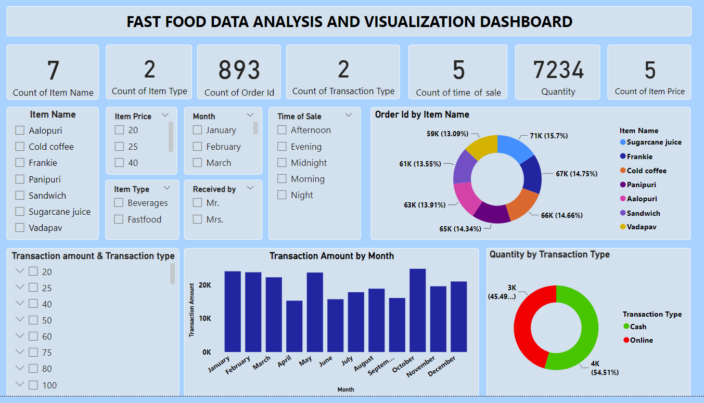

# Fast Food Data Analyst And Visualization

- Data Loading: Start by loading your dataset using Pandas and examine the structure of your data.

- Data Cleaning and Preprocessing: Perform data cleaning tasks such as handling missing values, removing duplicates, and converting data types if necessary. Preprocess the data for machine learning by encoding categorical variables and scaling numerical features.

- Exploratory Data Analysis (EDA): Utilize Pandas, Seaborn, and Matplotlib to explore the characteristics of your dataset. Visualize distributions, correlations, and patterns in your data to gain insights into the relationships between different variables.

- Feature Engineering: Create new features or transform existing ones that may improve the performance of your machine learning models. This could involve creating interaction terms, binning numerical variables, or extracting information from datetime columns.

- Model Selection and Training: Choose appropriate machine learning models for your regression task, such as Linear Regression, Random Forest Regression, Gradient Boosting Regression, etc. Train these models on your training data using Scikit-learn.

- Model Evaluation: Evaluate the performance of your trained models using appropriate metrics such as Mean Squared Error (MSE), Root Mean Squared Error (RMSE), and R-squared. Compare the performance of different models to identify the best-performing one.

Throughout the process, it's important to document your workflow, including any decisions made, insights gained, and results obtained. This will help you communicate your findings and replicate your analysis in the future. Additionally, be prepared to iterate on your approach as you gain more insights from the data and experimentation.
## Tools Used
### Python Programming Language
### Dashboard: Power BI
### Libraries Used 
> - NumPy
> - Pandas
> - Scikit-learn
> - Seaborn
> - Matplotlib
> - Time
> - Datetime
---
***
### Author
> TranTrucVy: 
<*https://github.com/TranTrucVy*>